# Installing Arch Linux with VirtualBox

> [!WARNING] 
> Dieser Leitfaden ist derzeit in Arbeit. Seien Sie gespannt auf Updates – es ist noch nicht voll funktionsfähig!

---

## Voraussetzungen

Bevor Sie fortfahren, stellen Sie sicher, dass die folgenden Komponenten installiert sind:

### 1. VirtualBox
VirtualBox ist erforderlich, um eine virtuelle Maschine für Arch Linux zu erstellen.

🔗 **Download:** [Get VirtualBox](https://www.virtualbox.org/)

Darüber hinaus benötigen Sie eine funktionierende C++-Entwicklungsumgebung:

🔗 **Download:** [Get VisualStudio](https://visualstudio.microsoft.com/downloads/)


### 2. Arch Linux ISO
Zur Installation des Systems in der virtuellen Maschine ist die neueste Arch Linux ISO-Datei erforderlich.

🔗 **Download:** [Arch Linux 2025.03.01 ISO](https://geo.mirror.pkgbuild.com/iso/2025.03.01/)

---

## Installation

1. Schritt: Öffnen Sie VirtualBox und klicken Sie auf die Schaltfläche Neu.


2. Schritt: Geben Sie den Namen Ihrer virtuellen Maschine ein. 
`Typ` und `Version` sollten automatisch erkannt werden, wenn Sie `Arch Linux` in das Namensfeld eingeben. 
Bei neueren VirtualBox-Versionen können Sie die ISO-Datei hier selbst auswählen, dennoch können Sie diese auch später unter `Ändern` einbinden.


3. Schritt: Sie sollten die Speichergröße erhöhen, um die virtuelle Maschine bequem nutzen zu können. 
Wenn es nur um kleinere Tests geht, können Sie mit der Standardeinstellung fortfahren.
In meinem Fall weise ich `~5 GB RAM` und `5 Prozessorkerne` zu.
Stellen Sie außerdem sicher, dass Sie unter der Option `Festplatte` eine virtuelle Festplatte erstellen. 
Dies sollte standardmäßig die ausgewählte Option sein. 
(Bei den neueren Versionen von VirtualBox ist diese Option im nächsten Schritt enthalten.)


4. Schritt: Sie können einen bevorzugten Speicherortpfad für die virtuelle Festplatte auswählen und die Größe Ihren Anforderungen entsprechend anpassen. 
Um die Hardwareparameter festzulegen, müssen Sie das Kontrollkästchen `Jetzt virtuelle Festplatte erstellen` aktivieren.
Die Installation sollte mit der zugewiesenen Mindestgröße `8 GB` kein Problem darstellen, aber um auf Nummer sicher zu gehen, sollten Sie mindestens `10–15 GB` zuweisen.
Der Festplattendateityp ist standardmäßig `VDI` (VirtualBox Disk Image). Außerdem ist die Speicherzuweisung standardmäßig auf dynamisch eingestellt. 
Wenn Sie die gesamte Größe gleich zu Beginn zuweisen möchten, können Sie das Kontrollkästchen `Volle Größe vorab zuweisen` aktivieren.
Als Nächstes müssen Sie den Festplattendateityp als `VDI` und den Speicher als `Dynamisch zugewiesen` auswählen, wie im Bild oben gezeigt.
Und wenn Sie die Option `Dynamisch zugewiesen` für den Festplattenspeicher auswählen, bedeutet dies, dass der Speicherplatz je nach Nutzung genutzt wird. 
Mit anderen Worten: `10 GB` Speicherplatz werden nicht von Ihrer Festplatte gesperrt, sobald die virtuelle Maschine erstellt wird.


5. Schritt: Klicken Sie auf die Schaltfläche `Ändern`.


6. Schritt: Wenn Sie einen modernen PC haben können Sie `3D Beschleunigung` aktivieren und dann den Grafikspeicher auf `256 MB` setzten.


7. Schritt: Fügen Sie das Installationsmedium zur VM hinzu. 


8. Schritt: 


9. Schritt: Sie können die virtuelle Maschine Starten, indem Sie entweder die `Start-Schaltfläche` drücken oder auf die VM doppelklicken.


10. Schritt: Arch Linux hat die Installation durch die Einführung eines geführten Installationsprogramms vereinfacht, d. h. es bietet Ihnen alle Optionen, die Sie zum Einrichten eines vollwertigen Arch Linux-Systems benötigen.
Mithilfe eines geführten Installationsprogramms müssen Sie also eine Desktop-Umgebung und andere wichtige Pakete nicht separat selbst installieren. 
Sie müssen lediglich den Anweisungen auf dem Bildschirm folgen und die für Ihre Installation geeigneten Optionen auswählen.
In diesem Artikel konzentrieren wir uns auf das geführte Installationsprogramm. 
Wenn Sie die Dinge selbst erledigen möchten, sollten Sie unserer Arch-Installationsanleitung folgen.
Wenn Sie mit der Installation fortfahren und die VM starten, wird dieser Bildschirm angezeigt:


11. Schritt: Die erste Option ist die ideale Vorgehensweise. Wenn Sie eine spezielle Anforderung haben, können Sie andere Optionen wählen, um Arch Linux zu starten.


12. Schritt: Internetverbindung prüfen
Um sicherzustellen, dass dein System mit dem Internet verbunden ist, können Sie den Befehl `ping -c 5 archlinux.org` verwenden. 
Dieser Befehl sendet fünf Anfragen an den Arch Linux Server und überprüft, ob Sie eine Antwort erhalten. 
Falls keine Verbindung besteht, sollten Sie ihre Netzwerkeinstellungen überprüfen.

```bash
ping -c 5 archlinux.org
```

13. Schritt: Paketlisten aktualisieren und Basissystem installieren
Zuerst aktualisieren Sie die Paketlisten mit `pacman -Sy`, um sicherzustellen, dass Sie Zugriff auf die neuesten Pakete haben. 
Anschließend installieren Sie den Arch Linux Keyring mit `pacman -S archlinux-keyring`, der notwendig ist, um die Authentizität von Paketen zu überprüfen. 
Danach installieren Sie das Installationsskript archinstall mit `pacman -S archinstall`. 
Mit dem Befehl `archinstall` starten Sie den interaktiven Installationsprozess, der dir hilft, Arch Linux Schritt für Schritt zu installieren.

```bash
pacman -Sy
pacman -S archlinux-keyring
pacman -S archinstall
archinstall
```

14. Schritt:
Dies ist der Hauptkonfigurationsbildschirm. Hier legen Sie die Installationsoptionen fest, die Sie verwenden möchten. 
In den meisten Fällen verwenden Sie die Auf- und Ab-Pfeiltasten auf Ihrer Tastatur, um durch diesen Bildschirm zu navigieren. 
Manchmal verwenden Sie die `Leertaste` und manchmal die `Esc`-Taste. 
Da die Sprachauswahl bereits hervorgehoben ist, drücken Sie hier einfach die `Eingabetaste`.


15. Schritt:
Wählen Sie einfach mit den Auf- und Ab-Pfeiltasten die gewünschte Sprache aus und drücken Sie dann `Enter`. 
Die Zahl hinter der Sprache gibt Aufschluss über die bisherige Unterstützung für diese Sprache. 
Einige Sprachen werden besser unterstützt als andere.


16. Schritt:
Wählen Sie als Nächstes mit dem Abwärtspfeil „Locales“ aus. Abhängig von Ihrer Tastatur und Sprache müssen Sie dies möglicherweise anpassen. 
Da ich jedoch eine US-englische Tastatur verwende, kann ich hier einfach die Standardeinstellungen verwenden. 
Drücken Sie einfach `Enter` und Sie gelangen zurück zum Hauptkonfigurationsbildschirm. 
Wählen Sie mit dem Abwärtspfeil `Mirrors` aus und drücken Sie `Enter`.


17. Schritt:
Belassen `Mirror` auf beseecher Einstellung, da dieser automatisch die besten Spiegelserver für deine Region auswählt. 
Dadurch wird sichergestellt, dass Sie während der Installation die schnellsten und stabilsten Server verwenden, was zu einer besseren Download-Geschwindigkeit und weniger Installationsproblemen führt. 
Manuelle Änderungen am Mirror könnten zu einer schlechteren Performance oder unerwarteten Fehlern führen. 
Daher ist es ratsam, die Standard-Einstellungen zu belassen, um eine reibungslose Installation zu gewährleisten.

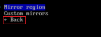

18. Schritt:
Als nächstes müssen Sie das Festplattenlayout einrichten. Wählen Sie mit dem Abwärtspfeil `Festplattenkonfiguration` aus und drücken Sie die `Eingabetaste`.


Als nächstes sehen Sie den Trennbildschirm. Fahren Sie fort und drücken Sie hier `Enter`.


Wenn Sie keine Erfahrung mit dem Erstellen von Linux-Partitionen auf einer Festplatte haben, würde ich mich einfach für die Option `Nach bestem Wissen und Gewissen verwenden` oben entscheiden.


Die meisten von Ihnen werden hier nur eine Festplatte sehen. Wenn Sie mehr als einen Datenträger sehen, stellen Sie sicher, dass Sie den richtigen Datenträger ausgewählt haben. 
Dadurch wird alles auf der ausgewählten Festplatte gelöscht. Drücken Sie die `Leertaste`-Leiste, und Sie sollten ein kleines `x` in den Klammern neben der ausgewählten Festplatte sehen. 
Fahren Sie fort und drücken Sie `Enter`.


Sie werden dann gefragt, welches Dateisystemformat Sie verwenden möchten. 
Wenn Sie sich nicht sicher sind, wählen Sie einfach `ext4`. Drücken Sie `Enter`.


Sie werden dann gefragt, welches Dateisystemformat Sie verwenden möchten. Wenn Sie sich nicht sicher sind, wählen Sie einfach `ext4`. 
Drücken Sie `Enter` Die meisten von Ihnen werden hier nur eine Disk sehen. Wenn Sie mehr als einen Datenträger sehen, stellen Sie sicher, dass Sie den richtigen Datenträger ausgewählt haben. 
WARNUNG: Dadurch wird alles auf der ausgewählten Festplatte gelöscht. Drücken Sie die `Leertaste`-Leiste, und Sie sollten ein kleines `x` in den Klammern neben der ausgewählten Festplatte sehen. 
Fahren Sie fort und drücken Sie `Enter`.

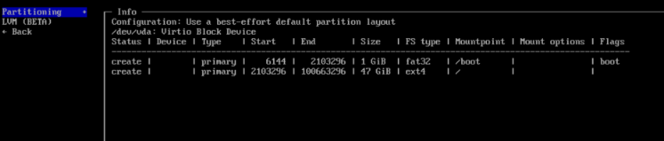

19. Schritt:
Swap wird aktiviert, um den RAM bei Bedarf zu erweitern, wenn der physische Speicher voll ist. Dies hilft, das System stabil zu halten, besonders bei Systemen mit weniger RAM. 
Diesbezüglich soll `Swap` als `Enabled` festgelegt werden.

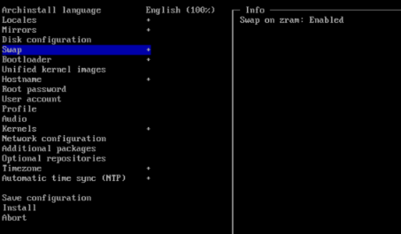

20. Schritt:
Grub ist der Standard-Bootloader und bietet eine einfache Möglichkeit, mehrere Betriebssysteme zu starten oder beim Starten des Systems Anpassungen vorzunehmen.
Daher soll als `Bootloader` `Grub` festgelegt werden.

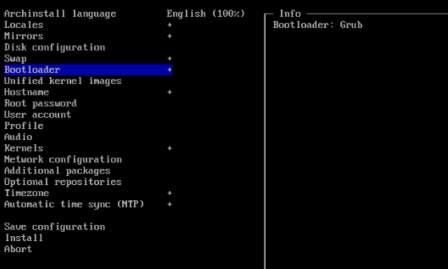

21. Schritt:
Desweitermen stellen Sie `Unified kernel images` als `Disabled` fest, da das Deaktivieren der Unified Kernel Images dann sinnvoll ist, wenn Sie spezifische Anpassungen am Kernel vornehmen möchten.

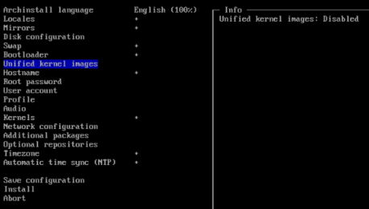

22. Schritt:
Dan fülle bitte noch `Hostname`, `Root password` und `User account` aus!

Hostname:
archlinux

Root password:
(Sie sollten hier ein sicheres Passwort setzen, zum Beispiel: Passwort123)

User account:
Username: user
Password: (Setze hier ein Passwort für den Benutzer)

23. Schritt:
Wenn die geschehen ist wählen Sie mit dem Abwärtspfeil `Profil` aus und drücken Sie die `Enter`.

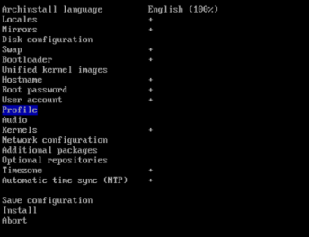

Wählen Sie als Nächstes die Option `Typ` und drücken Sie die `Enter`.


Ein Profil ist genau die Art von Installation, die Sie sich wünschen. 
Das ist keine feste Regel. Dies ist nur eine grundlegende Richtlinie. 
Die meisten von euch werden hier `Desktop` auswählen und `Enter` drücken.

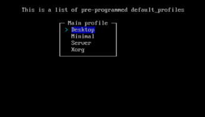

Nun können Sie auswählen, welche Desktop-Umgebung Sie installieren möchten. 
Arch hat nicht wirklich einen "Standard"-Desktop, so dass Sie auswählen können, was Sie möchten. 
`Cinnamon`, `Mate`, `KDE` und `GNOME` sind alle beliebt - [Hier finden Sie die richtige DE de-de.md](de-de.md). 
Ich werde `GNOME` für diese Installation wählen. Verwenden Sie die Pfeiltasten nach oben und unten, um Ihre Auswahl zu treffen. 
Sobald sie hell ist, drücken Sie die `Leertaste`-Leiste. Sie sollten ein smll `x` in den eckigen Klammern neben Ihrer Auswahl sehen. 
Fahren Sie fort und drücken Sie `Enter`. Dies bringt uns zurück zum Hauptkonfigurationsbildschirm.

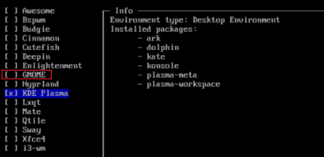

Inzwischen sollten Sie den Dreh raus haben, welche Tasten Sie drücken müssen. 
Also wählen Sie `Grafiktreiber`. Wenn Sie eine diskrete Nvidia-Karte haben, sollten Sie hier nouveau verwenden. 
Wenn Sie eine neuere Radeon haben, verwenden Sie die `andgpu`. Wenn es sich um eine ältere Radeon handelt, verwenden Sie `ati`. 
Wenn Sie sich nicht sicher sind, was Sie haben, drücken Sie einfach `Enter` und es werden alle installiert. Das tut nicht weh. 
Linux weiß, welches es verwenden soll. Es nimmt nur etwas mehr Platz auf Ihrer Festplatte ein.

Wählen Sie als Nächstes Ihren `Greeter` aus. Dies ist Ihr Anmeldebildschirm. Da `sddm` die Standardeinstellung ist, werden Sie damit fortfahren.
Anstatt `Enter` zu drücken, können Sie dieses Mal `Zurück` auswählen und dann die `Enter` drücken. 
Nun, Linux.org sagt, dass ich mein Limit erreicht habe, wie viele Grafiken in einem Nachrichtenbeitrag enthalten sein können (es sind 40, falls Sie sich fragen). 
Also muss ich das unten weiter machen. Ich sehe, dass in der Zwischenzeit einige Nachrichten in diesem Thread gepostet wurden, also müsst ihr nach unten scrollen, um zu finden, wo Sie aufgehört haben.

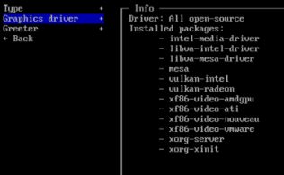

24. Schritt:
Sie sind gerade mit der Auswahl unseres Grafiktreibers fertig. Nun müssen Sie unseren `Greeter` auswählen.
Da sddm bereits als Standard ausgewählt ist, werden Sie einfach das verwenden.
Als nächstes müssen Sie ein `Audioserver-Paket` hinzufügen.

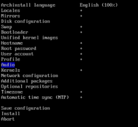

Die meisten von uns wollen `Rohrdraht`. Das können Sie auswählen.

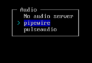

25. Schritt:
Als nächstes müssen Sie ihm mitteilen, welche Art von Kernel Sie verwenden möchten. Natürlich wollen Sie `Linux`.


26. Schritt:
Wie der Audioserver oben wird der Netzwerkmanager nicht installiert, es sei denn, Sie teilen Arch mit, dass Sie ihn möchten.

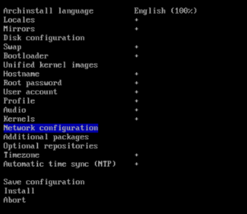

Die meisten von Ihnen werden sich für NetworkManager entscheiden wollen. Hier steht, dass Sie Ihr Netzwerk in Gnome und KDE konfigurieren müssen. Das stimmt, aber es gibt einen Befehlszeilenteil von NetworkManager, der ebenfalls installiert wird.

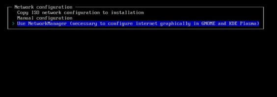

27. Schritt:
Jetzt können Sie ein paar benutzerdefinierte Pakete hinzufügen, die nicht standardmäßig installiert werden. 
Ich mag VLC, um Audiodateien anzuhören. Möglicherweise möchten Sie einen Webbrowser wie Firefox. (Nein, das wird auch nicht standardmäßig installiert). 
Vielleicht wäre Gimp eine gute Option. Das Problem dabei ist, dass Sie erst dann wissen, was verfügbar ist, wenn Sie dies ein paar Mal getan haben. 
Es ist ein bisschen so, als würde man raten. Wenn Sie mehr als eine möchten, setzen Sie einfach ein Leerzeichen dazwischen. 
Im Moment möchten Sie wahrscheinlich mindestens Firefox.

Ich persönlich nutze gerne `git`, `fastfetch`, `htop`, `ansible` und `vlc`, daher füge ich diese hier hinzu.

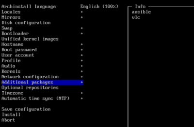

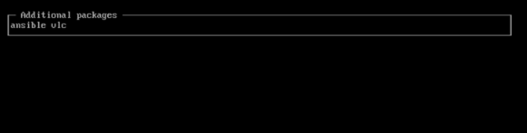

28. Schritt:
Jetzt können Sie einige optionale Repositorys hinzufügen, die die meisten von Ihnen benötigen dies jetzt.

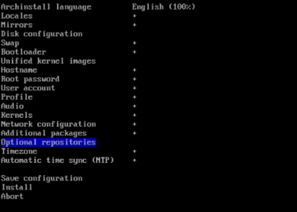

29. Schritt:
Wähle nun noch eine Timezone aus...

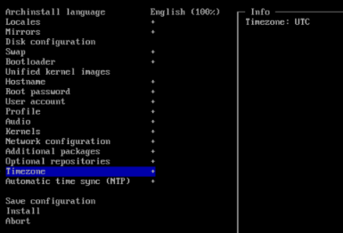

30. Schritt:
Zu guter Letzt können Sie auswählen, ob Sie `NTP` (Network Time Protocol) verwenden möchten. 
Die meisten von Ihnen werden das wollen. Es hält Datum und Uhrzeit auf Ihrem Computer automatisch auf dem neuesten Stand und die meisten, von `ISPs` bereitgestellten Verbindungen und Router unterstützen dies.

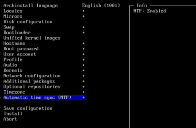

31. Schritt:
Nach all dem kommen Sie nun endlich zur eigentlichen Installation. 
Überpüfen Sie auch nochmal wirklich ob alle Einstellungen korrekt sind und Sie Nichts mehr vergessen haben!
Fahren Sie fort und drücken Sie hier die Eingabetaste und dan bewundern Sie die Magie!

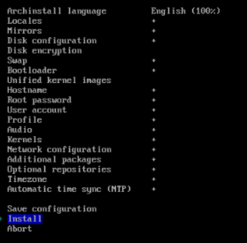

---
32. Schritt:
Nach dem Ausführen des `archinstall`-Befehls, der das System mit der Standard-Konfiguration installiert, gehen Sie folgendermaßen vor:

Um die grundlegenden Systeminformationen anzuzeigen, gebe im Terminal den folgenden Befehl ein:

```bash
fasfetch
```

Dies zeigt dir eine Übersicht über dein System, wie die Arch Linux-Version, die Architektur, das Kernel und andere nützliche Informationen.

33. Schritt:
Nun können Sie eine Reihe nützlicher Programme installieren. Gib diesen Befehl ein, um Firefox, VLC, LibreOffice Fresh, wget und curl zu installieren:

```bash
pacman -S firefox vlc libreoffice-fresh wget curl
```

Sie werden gefragt, ob Sie die Installation fortsetzen möchten. Bestätige dies mit der Eingabe von **1** und dann mit **y** für "Ja", um fortzufahren.

34. Schritt:
Falls Sie noch ein zusätzliches Paket installieren möchten, gebe den folgenden Befehl ein:

```bash
pacman -S faltpak
```

`Faltpak` ist ein weiteres Paket, das Sie nach Belieben installieren können (falls Sie es benötigen).

35. Schritt:
Wenn die Installation abgeschlossen ist, können Sie das Terminal schließen, indem Sie den folgenden Befehl eingeben:

```bash
exit
```

Dieser Befehl beendet die aktuelle Sitzung.

36. Schritt:
Um das System sicher herunterzufahren, gib einfach folgenden Befehl ein:

```bash
shutdown now
```

Dies fährt das System sofort herunter.

37. Schritt:
Nachdem Sie das System in VirtualBox heruntergefahren haben, sollten Sie das Arch Linux Installations-ISO aus dem virtuellen CD/DVD-Laufwerk entfernen.
Bütte drücken sie auf `Ändern`.


38. Schritt:
Im Reiter `Massenspeicher` klicken Sie auf das CD/DVD-Laufwerk und entfernen das ISO-Abbild, indem Sie auf das kleine CD-Symbol klicken und `Kein Medium` auswählen.
Klicken Sie dann auf `OK`, um die Änderungen zu speichern.

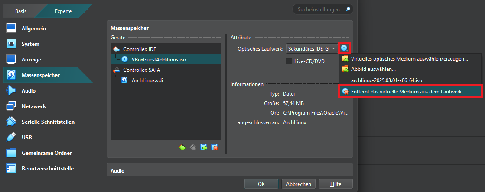

39. Schritt:
Jetzt können Sie die VM neu starten, und sie wird direkt von der Festplatte oder SSD booten, auf der Sie Arch Linux installiert haben.


Loggen Sie sich nun mit Ihrem festgelegtem Account ein.

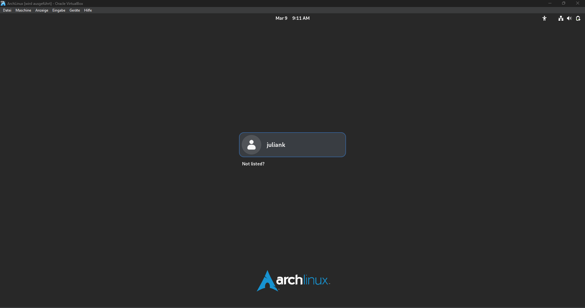

So Sieht Arch Linux nun aus mit der GNOME DE.

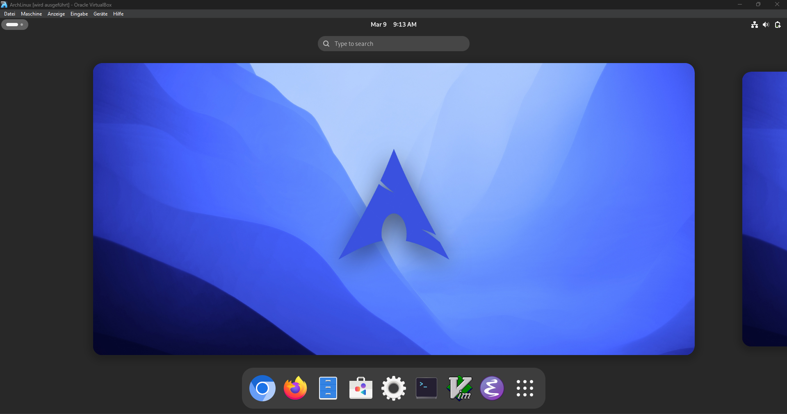

Öffnen Sie nun die Konsole.

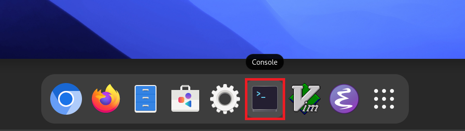

40. Schritt:
Geben Sie in die Konsole folgende Befehle ein, um das System zu aktualisieren und notwendige Pakete zu installieren:

Dieser Befehl synchronisiert die Paketdatenbank und aktualisiert das gesamte System auf die neueste Version:  

```bash
sudo pacman -Syyu
```

41. Schritt:
Diese Pakete sind wichtig, insbesondere wenn Sie Software kompilieren oder Kernel-Module (z. B. VirtualBox-Gasterweiterungen) nutzen möchten:  

```bash
sudo pacman -S base-devel linux-headers
```  

42. Schritt:
Gehen Sie dan auf Gerate in Ihrem fenster oben Links und drücken Sie dan auf Gasterweiterung einlegen!

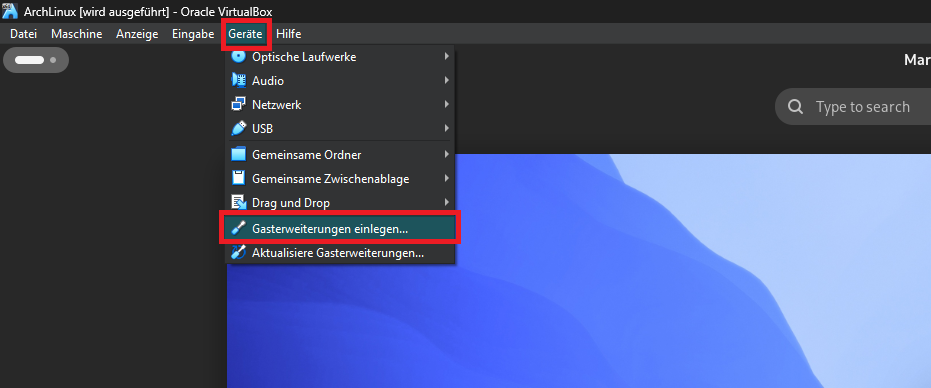

Öffnen Sie dan `Files`.

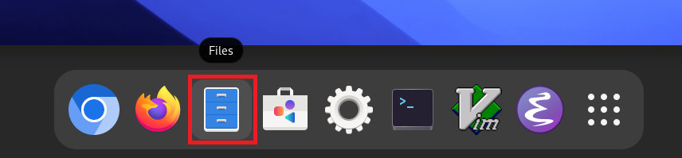

Drücken Sie auf das verzeichnis VBox_gasterweiterung und Kopieren Sie alles darin mit `Str. + c`.

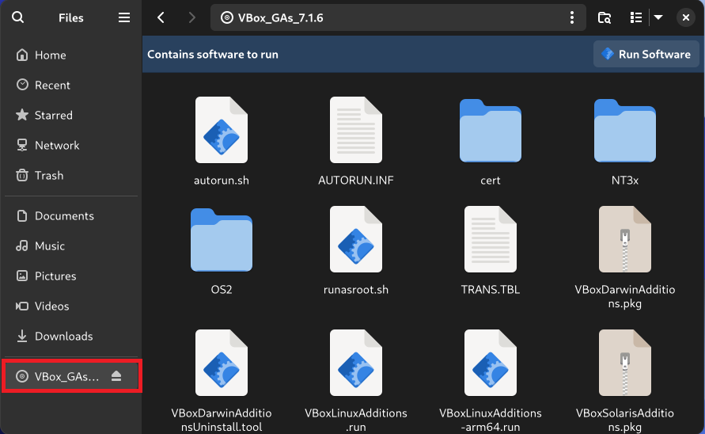

Gehen Sie dan in das Verzeichnis Documents und kopieren Sie alles darein mit `Str. + v`.

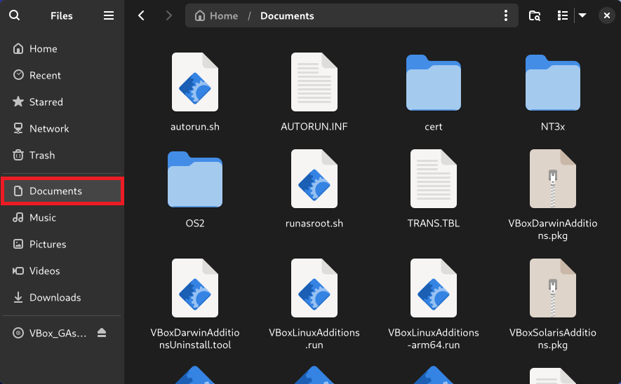

43. Schritt:
Öffnen Sie nun das Terminal wider und wechsle mit folgendem Befehl in den Ordner `Documents`:

```bash
cd Documents
```

Zeige die Dateien im aktuellen Verzeichnis an:

```bash
ls
```

Falls die Datei `VBoxLinuxAdditions.run` angezeigt wird, fahre mit den nächsten Schritten fort.

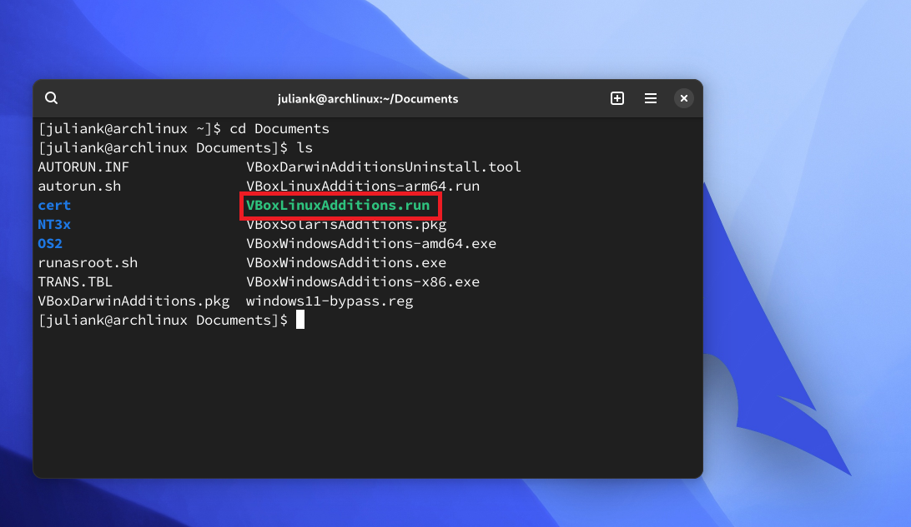

44. Schritt:
Machen Sie die Datei ausführbar, damit sie installiert werden kann:

```bash
sudo chmod 777 VBoxLinuxAdditions.run
```

Führen Sie die Datei aus, um die VirtualBox Gasterweiterungen zu installieren:

```bash
sudo ./VBoxLinuxAdditions.run
```

45. Schritt:
Damit die Änderungen wirksam werden, starte das System neu:

```bash
sudo reboot now
```

Hiermit haben Wir nun Arch Linux installiert!
