# Installing Arch Linux with VirtualBox

> [!WARNING] 
> This guide is currently a work in progress. Stay tuned for updates – it is not fully functional yet!

---

## Prerequisites

Before proceeding, ensure that you have the following components installed:

### 1. VirtualBox
VirtualBox is required to create a virtual machine for Arch Linux.

🔗 **Download:** [Get VirtualBox](https://www.virtualbox.org/)

Additionally, you need a working C++ development environment:

🔗 **Download:** [Get VisualStudio](https://visualstudio.microsoft.com/downloads/)


### 2. Arch Linux ISO
The latest Arch Linux ISO file is required to install the system in the virtual machine.

🔗 **Download:** [Arch Linux 2025.03.01 ISO](https://geo.mirror.pkgbuild.com/iso/2025.03.01/)

---

## Installation

1. Step: Open VirtualBox and click on the New button.

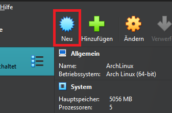

2. Step: Geben Sie den Namen Ihrer virtuellen Maschine ein. „Typ“ und „Version“ sollten automatisch erkannt werden, wenn Sie „Arch Linux“ in das Namensfeld eingeben. Bei neueren VirtualBox-Versionen können Sie die ISO-Datei hier selbst auswählen, dennoch können Sie diese auch später unter 'Ändern' einbinden.

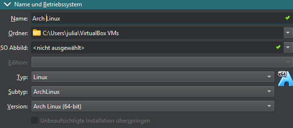

3. Step: Sie sollten die Speichergröße erhöhen, um die virtuelle Maschine bequem nutzen zu können. 
Wenn es nur um kleinere Tests geht, können Sie mit der Standardeinstellung fortfahren.
In meinem Fall weise ich ~5 GB RAM und 5 Prozessorkerne zu.
Stellen Sie außerdem sicher, dass Sie unter der Option „Festplatte“ eine virtuelle Festplatte erstellen. Dies sollte standardmäßig die ausgewählte Option sein. (Bei den neueren Versionen von VirtualBox ist diese Option im nächsten Schritt enthalten.)

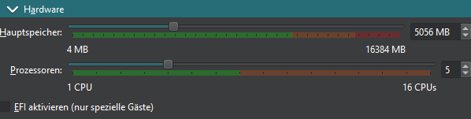

4. Step: Sie können einen bevorzugten Speicherortpfad für die virtuelle Festplatte auswählen und die Größe Ihren Anforderungen entsprechend anpassen. Um die Hardwareparameter festzulegen, müssen Sie das Kontrollkästchen „Jetzt virtuelle Festplatte erstellen“ aktivieren.

Die Installation sollte mit der zugewiesenen Mindestgröße (8 GB) kein Problem darstellen, aber um auf Nummer sicher zu gehen, sollten Sie mindestens 10–15 GB zuweisen.

Der Festplattendateityp ist standardmäßig VDI (VirtualBox Disk Image). Außerdem ist die Speicherzuweisung standardmäßig auf dynamisch eingestellt. Wenn Sie die gesamte Größe gleich zu Beginn zuweisen möchten, können Sie das Kontrollkästchen „Volle Größe vorab zuweisen“ aktivieren.

Als Nächstes müssen Sie den Festplattendateityp als „VDI (VirtualBox Disk Image)“ und den Speicher als „Dynamisch zugewiesen“ auswählen, wie im Bild oben gezeigt.

VDI ist der gebräuchlichste Festplattentyp für die virtuelle Festplatte.

Und wenn Sie die Option „Dynamisch zugewiesen“ für den Festplattenspeicher auswählen, bedeutet dies, dass der Speicherplatz je nach Nutzung genutzt wird. Mit anderen Worten: 10 GB Speicherplatz werden nicht von Ihrer Festplatte gesperrt, sobald die virtuelle Maschine erstellt wird.

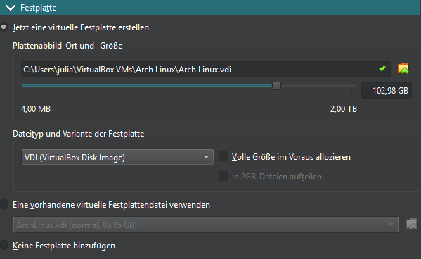

5. Step: Click on the Setting button.

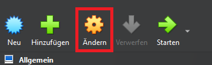

6. Step: 

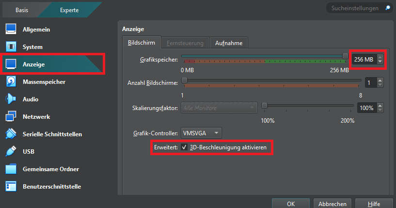

7. Step: Add the installation media to the VM

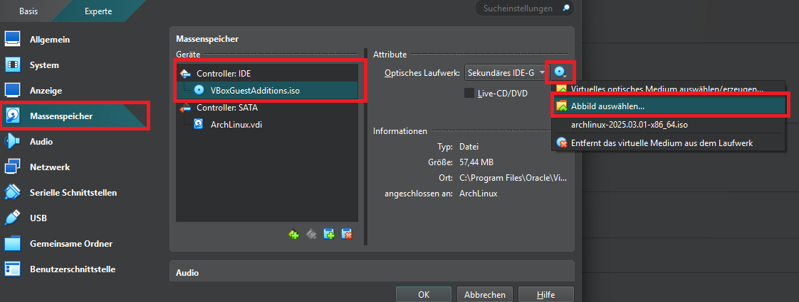

8. Step: 

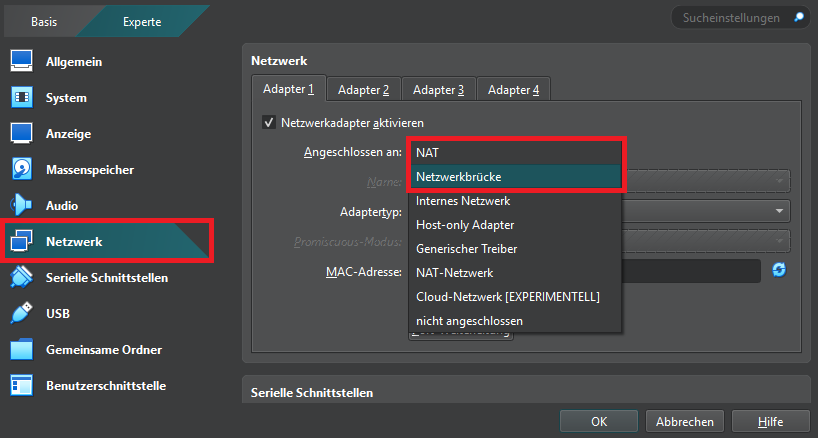

9. Step: Sie können die virtuelle Maschine starten, indem Sie entweder die Start-Schaltfläche drücken oder auf die VM doppelklicken.

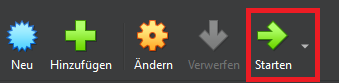

10. Step: Arch Linux hat die Installation durch die Einführung eines geführten Installationsprogramms vereinfacht, d. h. es bietet Ihnen alle Optionen, die Sie zum Einrichten eines vollwertigen Arch Linux-Systems benötigen.

Mithilfe eines geführten Installationsprogramms müssen Sie also eine Desktop-Umgebung und andere wichtige Pakete nicht separat selbst installieren. Sie müssen lediglich den Anweisungen auf dem Bildschirm folgen und die für Ihre Installation geeigneten Optionen auswählen.

In diesem Artikel konzentrieren wir uns auf das geführte Installationsprogramm. Wenn Sie die Dinge selbst erledigen möchten, sollten Sie unserer Arch-Installationsanleitung folgen.

Wenn Sie mit der Installation fortfahren und die VM starten, wird dieser Bildschirm angezeigt:


11. Step: Die erste Option ist die ideale Vorgehensweise. Wenn Sie eine spezielle Anforderung haben, können Sie andere Optionen wählen, um Arch Linux zu starten.


Hier ist die verbesserte Version deines 12. Schritts für die Arch-Linux-Installation:

12. Step: Internetverbindung prüfen

   ```bash
   ping -c 5 archlinux.org
   ```

13. Step: Aktualisiere die Paketlisten und installiere das Basissystem:

```bash
pacman -Sy
pacman -S archlinux-keyring
pacman -S archinstall
archinstall
```

13. Step:

Dies ist der Hauptkonfigurationsbildschirm. Hier legen Sie die Installationsoptionen fest, die Sie verwenden möchten. 
In den meisten Fällen verwenden Sie die Auf- und Ab-Pfeiltasten auf Ihrer Tastatur, um durch diesen Bildschirm zu navigieren. 
Manchmal verwenden Sie die [Leertaste] und manchmal die [Esc]-Taste. 
Da die Sprachauswahl bereits hervorgehoben ist, drücken Sie hier einfach die [Eingabetaste].


Wählen Sie einfach mit den Auf- und Ab-Pfeiltasten die gewünschte Sprache aus und drücken Sie dann [Enter]. 
Die Zahl hinter der Sprache gibt Aufschluss über die bisherige Unterstützung für diese Sprache. 
Einige Sprachen werden besser unterstützt als andere.


Wählen Sie als Nächstes mit dem Abwärtspfeil „Locales“ aus. Abhängig von Ihrer Tastatur und Sprache müssen Sie dies möglicherweise anpassen. Da ich jedoch eine US-englische Tastatur verwende, kann ich hier einfach die Standardeinstellungen verwenden. Drücken Sie einfach [Enter] und Sie gelangen zurück zum Hauptkonfigurationsbildschirm. Wählen Sie mit dem Abwärtspfeil „Mirrors“ aus und drücken Sie [Enter].

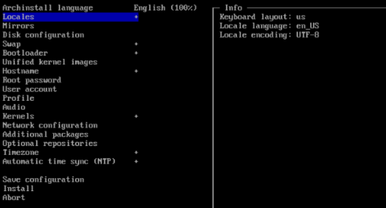

Als nächstes müssen wir das Festplattenlayout einrichten. Wählen Sie mit dem Abwärtspfeil „Festplattenkonfiguration“ aus und drücken Sie die [Eingabetaste].

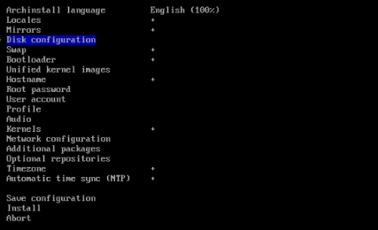

Als nächstes sehen Sie den Trennbildschirm. Fahren Sie fort und drücken Sie hier [Enter].

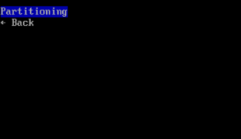

Wenn Sie keine Erfahrung mit dem Erstellen von Linux-Partitionen auf einer Festplatte haben, würde ich mich einfach für die Option "Nach bestem Wissen und Gewissen verwenden" oben entscheiden.

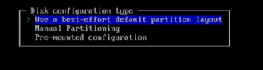

Wenn Sie keine Erfahrung mit dem Erstellen von Linux-Partitionen auf einer Festplatte haben, würde ich mich einfach für die Option "Nach bestem Wissen und Gewissen verwenden" oben entscheiden. Die meisten von Ihnen werden hier nur eine Festplatte sehen. Wenn Sie mehr als einen Datenträger sehen, stellen Sie sicher, dass Sie den richtigen Datenträger ausgewählt haben. WARNUNG: Dadurch wird alles auf der ausgewählten Festplatte gelöscht. Drücken Sie die [Leertaste]-Leiste, und Sie sollten ein kleines "x" in den Klammern neben der ausgewählten Festplatte sehen. Fahren Sie fort und drücken Sie [Enter]

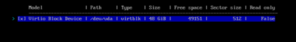

Sie werden dann gefragt, welches Dateisystemformat Sie verwenden möchten. Wenn Sie sich nicht sicher sind, wählen Sie einfach "ext4". Drücken Sie [Enter]

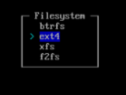

Folge dem interaktiven Installationsprozess. Wähle dabei:
- Dateisystem: **ext4**
- Desktop-Umgebung: **GNOME**
- Treiber: **Nur Open-Source-Treiber**
- Pakete: **git, fastfetch, htop**


```bash

```

*A step-by-step installation guide will be provided soon...* 🚀
