# Installing Arch Linux with VirtualBox

> [!WARNING]
> This guide is currently a work in progress. Stay tuned for updates – it's not fully functional yet!

---

## Prerequisites

Before you proceed, make sure you have the following components installed:

### 1. VirtualBox
VirtualBox is required to create a virtual machine for Arch Linux.

🔗 **Download:** [Get VirtualBox](https://www.virtualbox.org/)

In addition, you will need a working C++ development environment:

🔗 **Download:** [Get VisualStudio](https://visualstudio.microsoft.com/downloads/)


### 2. Arch Linux ISO
The latest Arch Linux ISO file is required to install the system in the virtual machine.

🔗 **Download:** [Arch Linux 2025.03.01 ISO](https://geo.mirror.pkgbuild.com/iso/2025.03.01/)

--

## Installation

Step 1: Open VirtualBox and click the New button.


Step 2: Enter the name of your virtual machine.
`Type` and `Version` should be automatically detected when you enter `Arch Linux` in the name field.
For newer VirtualBox versions, you can select the ISO file here yourself, but you can also mount it later under `Change`.


Step 3: You should increase the memory size to be able to use the virtual machine comfortably.
If it's just for minor testing, you can go with the default setting.
In my case, I'm allocating `~5 GB RAM` and `5 processor cores`.
Also, make sure to create a virtual hard disk under the `Hard Disk` option.
This should be the selected option by default.
(For the newer versions of VirtualBox, this option is included in the next step.)


Step 4: You can select a preferred location path for the virtual hard disk and adjust the size according to your requirements.
To set the hardware parameters, you need to check the `Create virtual hard disk now` box.
The installation should not be a problem with the minimum size allocated `8 GB`, but to be on the safe side, you should allocate at least `10–15 GB`.
The disk file type defaults to `VDI` (VirtualBox Disk Image). Also, the memory allocation is set to dynamic by default.
If you want to allocate the entire size right at the beginning, you can check the `Pre-allocate full size` checkbox.

Next, you need to select the disk file type as `VDI` and the storage as `Dynamically allocated` as shown in the image above.

And if you select the `Dynamically allocated` option for the disk storage, it means that the space will be used based on usage.

In other words, `10GB` space will not be locked from your disk once the virtual machine is created.


Step 5: Click the `Change` button.


Step 6: If you have a modern PC you can enable `3D Acceleration` and then set the graphics memory to `256 MB`.


Step 7: Add the installation media to the VM.


Step 8:


Step 9: You can start the virtual machine by either pressing the `Start` button or double-clicking the VM.


Step 10: Arch Linux has simplified the installation by introducing a guided installer, meaning it gives you all the options you need to set up a full-fledged Arch Linux system.

So, with the help of a guided installer, you don't have to install a desktop environment and other essential packages separately yourself.
All you have to do is follow the on-screen instructions and select the options that are appropriate for your installation.

In this article, we will focus on the guided installer.
If you want to do things yourself, you should follow our Arch installation guide.

When you proceed with the installation and boot up the VM, you will see this screen:


Step 11: The first option is the ideal way to go about it. If you have a special requirement, you can choose other options to start Arch Linux.


Step 12: Check Internet connection
To make sure your system is connected to the Internet, you can use the command `ping -c 5 archlinux.org`.
This command will send five requests to the Arch Linux server and check if you get a response.
If there is no connection, you should check your network settings.

```bash
ping -c 5 archlinux.org
```

Step 13: Update package lists and install base system
First, update the package lists with `pacman -Sy` to make sure you have access to the latest packages.
Then install the Arch Linux keyring with `pacman -S archlinux-keyring`, which is necessary to verify the authenticity of packages.
After that, install the archinstall installation script with `pacman -S archinstall`.
The `archinstall` command starts the interactive installation process that helps you install Arch Linux step by step.

```bash
pacman -Sy
pacman -S archlinux-keyring
pacman -S archinstall
archinstall
```

Step 14:
This is the main configuration screen. Here you set the installation options you want to use.
In most cases, you will use the up and down arrow keys on your keyboard to navigate through this screen.
Sometimes you will use the `Space` and sometimes the `Esc` key.
Since the language selection is already highlighted, just press `Enter` here.


Step 15:
Simply use the up and down arrow keys to select the language you want and then press `Enter`.
The number behind the language will tell you the level of support for that language so far.
Some languages ​​are better supported than others.


Step 16:
Next, use the down arrow to select `Locales`. Depending on your keyboard and language, you may need to adjust this.
However, since I use a US English keyboard, I can just use the default settings here.
Just press `Enter` and you'll be taken back to the main configuration screen.
Use the down arrow to select `Mirrors` and press `Enter`.


Step 17:
Leave `Mirror` on beseecher setting as it will automatically select the best mirror servers for your region.
This will ensure that you use the fastest and most stable servers during installation, resulting in better download speed and fewer installation issues.
Manual changes to the mirror could result in worse performance or unexpected errors.
So it is advisable to leave the default settings to ensure a smooth installation.


Step 18:
Next you need to set up the disk layout. Use the down arrow to select `Disk Configuration` and press `Enter`.


Next you will see the separation screen. Go ahead and press `Enter` here.


If you have no experience creating Linux partitions on a hard drive, I would just go with the `Use my best judgment` option above.


Most of you will only see one disk here. If you see more than one disk, make sure you have selected the correct disk.
This will erase everything on the selected disk. Press the `Space` bar and you should see a small `x` in the brackets next to the selected disk.
Go ahead and press `Enter`.


You will then be asked which file system format you want to use.
If you are unsure, just select `ext4`. Press `Enter`.


You will then be asked which file system format you want to use. If you are unsure, just select `ext4`.
Press `Enter` Most of you will only see one disk here. If you see more than one disk, make sure you have selected the correct disk.
WARNING: This will erase everything on the selected disk. Press the `Space` bar and you should see a small `x` in the brackets next to the selected disk.
Go ahead and press `Enter`.


Step 19:
Swap will be enabled to expand RAM when needed when physical memory is full. This helps keep the system stable, especially on systems with less RAM.
In this regard, `Swap` should be set as `Enabled`.

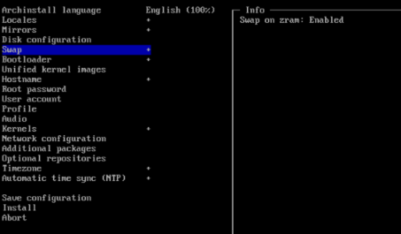

20th step:
Grub is the standard bootloader and offers an easy way to start multiple operating systems or make adjustments when starting the system.

You should therefore set `Grub` as the `Bootloader`.

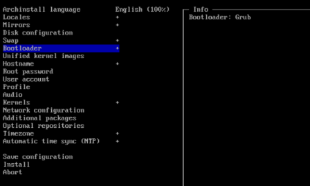

21st step:

Furthermore, set `Unified kernel images` to `Disabled`, as disabling the Unified Kernel Images is useful if you want to make specific adjustments to the kernel.

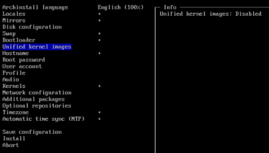

22nd step:

Then please fill in `Hostname`, `Root password` and `User account`!

Hostname:
archlinux

Root password:
(You should set a strong password here, for example: password123)

User account:
Username: user
Password: (Set a password for the user here)

Step 23:
When you're done, use the down arrow to select `Profile` and press `Enter`.


Next, select the `Type` option and press `Enter`.


A profile is exactly the type of installation you want.
This is not a hard and fast rule. This is just a basic guideline.
Most of you will select `Desktop` here and press `Enter`.

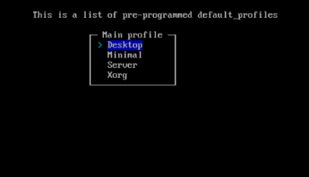

Now you can choose which desktop environment you want to install.
Arch doesn't really have a "default" desktop, so you can choose whatever you want.
`Cinnamon`, `Mate`, `KDE` and `GNOME` are all popular - [Find the correct DE de.md here](de.md).
I'm going to choose `GNOME` for this installation. Use the up and down arrow keys to make your selection.
Once it's light, press the `Space` bar. You should see a smll `x` in the square brackets next to your selection.
Go ahead and press `Enter`. This will take us back to the main configuration screen.


By now you should have the hang of which keys to press.
So select `Graphics Drivers`. If you have a discrete Nvidia card you should use nouveau here.
If you have a newer Radeon use the `andgpu`. If it's an older Radeon use `ati`.
If you're not sure what you have just press `Enter` and it will install them all. It doesn't hurt.
Linux knows which one to use. It just takes up a little more space on your hard drive.

Next select your `Greeter`. This is your login screen. Since `sddm` is the default you will continue with that.
Instead of pressing `Enter` this time you can select `Back` and then press the `Enter`.
Well, Linux.org says I've reached my limit of how many graphics can be in a message post (it's 40, in case you're wondering).
So I need to continue this below. I see that a few messages have been posted in this thread in the meantime, so you'll have to scroll down to find where you left off.

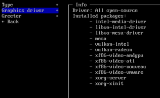

Step 24:
You've just finished selecting our graphics driver. Now you need to select our `Greeter`.

Since sddm is already selected as the default, you'll just use that.

Next you need to add an `Audio Server Package`.

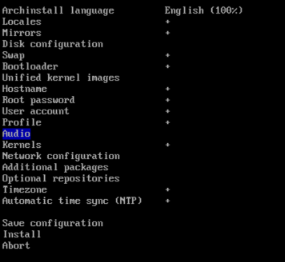

Most of us want `Pipe Wire`. You can select that.

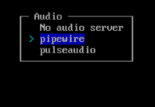

Step 25:
Next you need to tell it what kind of kernel you want to use. Obviously you want `Linux`.


Step 26:
Like the audio server above, the network manager won't be installed unless you tell Arch you want it.


Most of you will want to go with NetworkManager. It says here that you need to configure your network in Gnome and KDE. That's true, but there is a command line part of NetworkManager that will also be installed.


Step 27:
Now you can add a few custom packages that aren't installed by default.
I like VLC for listening to audio files. You may want a web browser like Firefox. (No, that doesn't come installed by default either).
Maybe Gimp would be a good option. The problem with this is that you won't know what's available until you've done this a few times.
It's a bit like guessing. If you want more than one, just put a space between them.
For now, you probably want Firefox at least.

I personally like to use `git`, `fastfetch`, `htop`, `ansible` and `vlc`, so I'm adding those here.

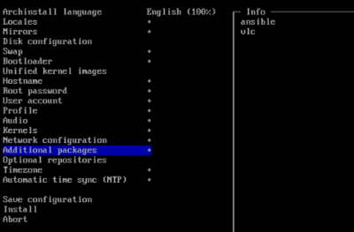

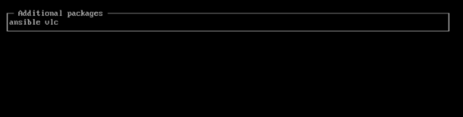

Step 28:
Now you can add some optional repositories, most of you will need this now.


Step 29:
Now select a timezone...


Step 30:
Finally, you can choose whether you want to use `NTP` (Network Time Protocol).
Most of you will want to do this. It automatically keeps the date and time on your computer up to date and most connections and routers provided by `ISPs` support this.


Step 31:
After all that, you finally come to the actual installation.
Make sure that all settings are correct and that you haven't forgotten anything!
Go ahead and press Enter here and admire the magic!

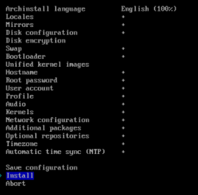

---
Step 32:
After running the `archinstall` command, which will install the system with the default configuration, do the following:

To view basic system information, type the following command in the terminal:

```bash
fasfetch
```

This will show you an overview of your system, such as the Arch Linux version, architecture, kernel, and other useful information.

Step 33:
Now you can install a number of useful programs. Type this command to install Firefox, VLC, LibreOffice Fresh, wget, and curl:

```bash
pacman -S firefox vlc libreoffice-fresh wget curl
```

You will be asked if you want to continue the installation. Confirm this by entering **1** and then **y** for "yes" to continue.

Step 34:
If you want to install an additional package, enter the following command:

```bash
pacman -S faltpak
```

`Faltpak` is another package that you can install at will (if you need it).

Step 35:
When the installation is complete, you can close the terminal by entering the following command:

```bash
exit
```

This command will end the current session.

Step 36:
To shut down the system safely, simply enter the following command:

```bash
shutdown now
```

This will shut down the system immediately.

Step 37:
After shutting down the system in VirtualBox, you should remove the Arch Linux installation ISO from the virtual CD/DVD drive.

Now press `Change`.


Step 38:
In the `Mass Storage` tab, click on the CD/DVD drive and remove the ISO image by clicking on the small CD icon and selecting `No Media`.

Then click `OK` to save the changes.


Step 39:
Now you can restart the VM and it will boot directly from the hard drive or SSD you installed Arch Linux on.


Now log in with your specified account.


This is what Arch Linux looks like with GNOME DE.

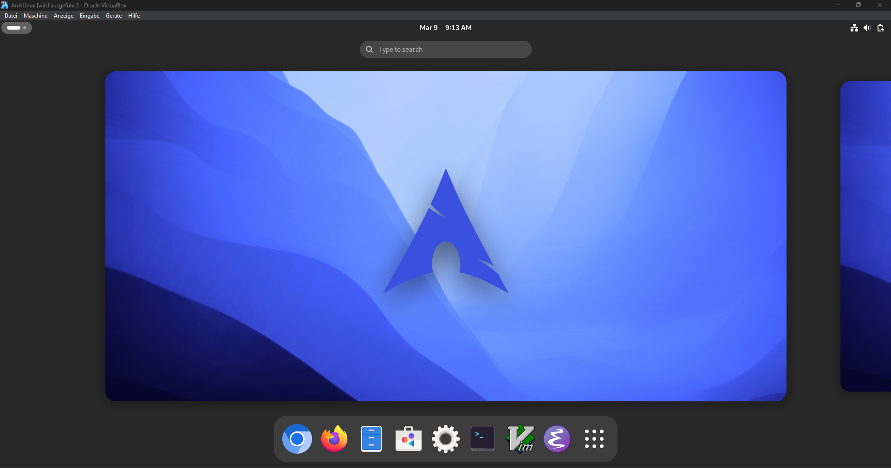

Now open the console.

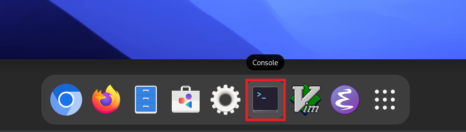

40th step:
Enter the following commands in the console to update the system and install necessary packages:

This command synchronizes the package database and updates the entire system to the latest version:

```bash
sudo pacman -Syyu
```

41st step:
These packages are important, especially if you want to compile software or use kernel modules (e.g. VirtualBox guest additions):

```bash
sudo pacman -S base-devel linux-headers
```

42nd step:
Then go to Devices in your window at the top left and then press Insert Guest Addition!


Then open `Files`.

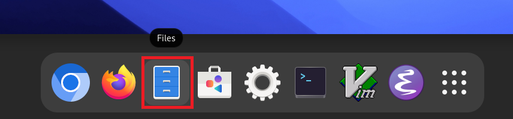

Click on the VBox_guest_extension directory and copy everything in it with `Str. + c`.

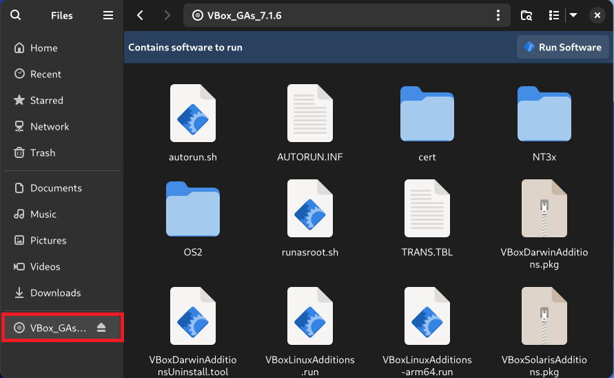

Then go to the Documents directory and copy everything in it with `Str. + v`.

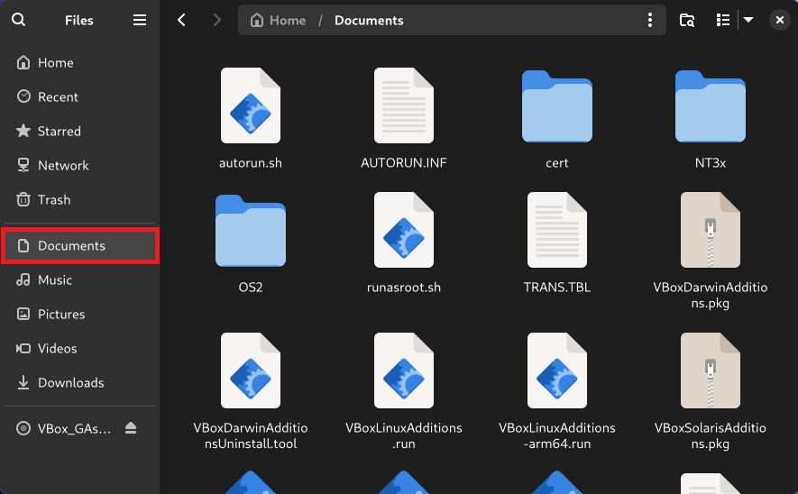

43rd step:
Now open the terminal again and switch to the `Documents` folder with the following command:

```bash
cd Documents
```

Display the files in the current directory:

```bash
ls
```

If the `VBoxLinuxAdditions.run` file is displayed, continue with the next steps.


44th step:
Make the file executable so it can be installed:

```bash
sudo chmod 777 VBoxLinuxAdditions.run
```

Run the file to install the VirtualBox guest additions:

```bash
sudo ./VBoxLinuxAdditions.run
```

45th step:
Reboot the system for the changes to take effect:

```bash
sudo reboot now
```

We have now installed Arch Linux!
